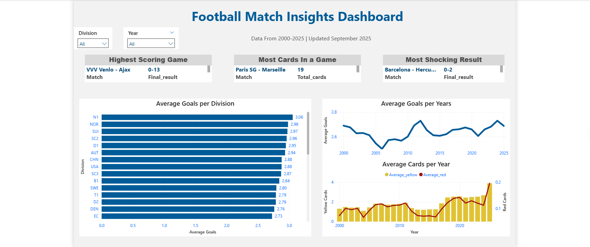
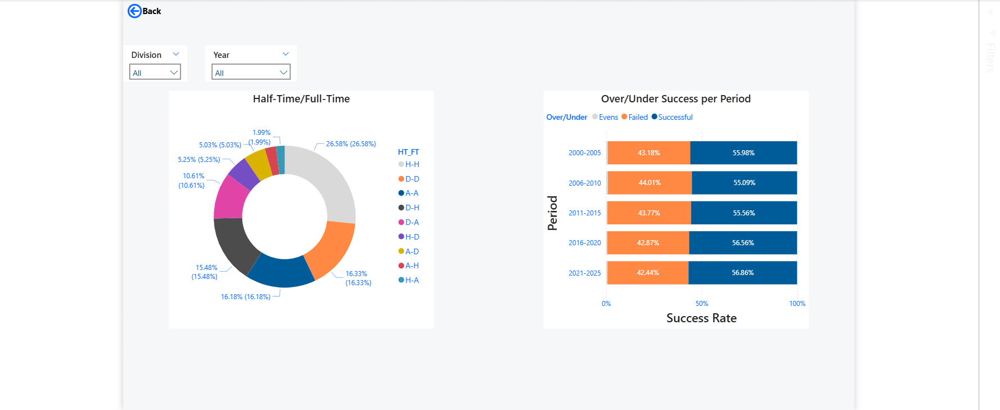

# Football Betting Dashboard

## Overview

An interactive Power BI dashboard analyzing historical football data, odds trends, and team performance trends. (2000-2025)

------------------------------------------------------------------------

## Preview Image

\
\

------------------------------------------------------------------------

## Dataset

### Author

Adam Gabor

### ORCID

<https://orcid.org/0009-0001-9252-5976>

### Affiliation

Faculty of Informatics and Information Technologies, Slovak University of Technology in Bratislava

### Year

2025

**Retrieved from** <https://github.com/xgabora/Club-Football-Match-Data-2000-2025/>.

------------------------------------------------------------------------

## Objective

The goal of the dashbboard was to:\
- Analyze the trends of goals and cards through years\
- Compare the odds against the actual results, whether bookmakers got better at predicting the outcomes of the matches through years\
- Identify outliers in terms of matches\
- Provide interactrive filters by leagues and years

------------------------------------------------------------------------

## Features

### KPIs

-   Highest scoring game\
-   Most cards in a game\
-   Most shocking result

### Visuals

-   Average goals per division\
-   Average goals per year\
-   Average cards per year\
-   Half time score, and Full time score\
-   Percentage of Over/Under 2.5 successful predictions through periods.

### Filters

-   Year\
-   Division

### Navigation

Multiple pages with a **Back** button

------------------------------------------------------------------------

## Technical Details

### Power Query

-   Data Cleaning\
-   Removing nulls\
-   Modifying columns data type\
-   Added column to aggregate home score and away score\
-   Added Column to create unique Match IDs, including date and teams\
-   Added column to calculate the total goals in each match

### DAX measures

#### - Successful predictions =

``` dax
VAR all_values =
    CALCULATE (
        COUNTROWS ( Matches ),
        NOT ( ISBLANK ( Matches[Odds_accuracy] ) ),
        REMOVEFILTERS ( Matches[Odds_accuracy] )
    )
VAR specific_value =
    CALCULATE (
        COUNTROWS ( Matches ),
        Matches[Odds_accuracy] = "Success",
        NOT ( ISBLANK ( Matches[Odds_accuracy] ) )
    )
RETURN
    DIVIDE ( specific_value, all_values )
```

#### -   Average goals =\

``` dax
AVERAGEX(Matches, [Total_goals])  
```

#### -   Average red cards =\

``` dax
AVERAGEX (
    ADDCOLUMNS (
        SUMMARIZE ( 'Matches', 'Matches'[MatchDate] ),
        "MatchYear", YEAR ( 'Matches'[MatchDate] )
    ),
    VAR CurrentYear = [MatchYear]
    VAR TotalRed =
        CALCULATE (
            SUM ( 'Matches'[AwayRed] ) + SUM ( 'Matches'[HomeRed] ),
            FILTER ( 'Matches', YEAR ( 'Matches'[MatchDate] ) = CurrentYear )
        )
    VAR MatchesCount =
        CALCULATE (
            COUNTROWS ( 'Matches' ),
            FILTER ( 'Matches', YEAR ( 'Matches'[MatchDate] ) = CurrentYear )
        )
    RETURN
        DIVIDE ( TotalRed, MatchesCount )
)
```

#### -   Average yellow cards=\

``` dax
AVERAGEX (
    ADDCOLUMNS (
        SUMMARIZE ( 'Matches', 'Matches'[MatchDate] ),
        "MatchYear", YEAR ( 'Matches'[MatchDate] )
    ),
    VAR CurrentYear = [MatchYear]
    VAR TotalYellow =
        CALCULATE (
            SUM ( 'Matches'[AwayYellow] ) + SUM ( 'Matches'[HomeYellow] ),
            FILTER ( 'Matches', YEAR ( 'Matches'[MatchDate] ) = CurrentYear )
        )
    VAR MatchesCount =
        CALCULATE (
            COUNTROWS ( 'Matches' ),
            FILTER ( 'Matches', YEAR ( 'Matches'[MatchDate] ) = CurrentYear )
        )
    RETURN
        DIVIDE ( TotalYellow, MatchesCount )
)
```

#### -   Half time and Full time results =\

``` dax
IF (
    OR (
        OR ( ISBLANK ( 'Matches'[HTResult] ), LEN ( TRIM ( 'Matches'[HTResult] ) ) = 0 ),
        OR ( ISBLANK ( 'Matches'[FTResult] ), LEN ( TRIM ( 'Matches'[FTResult] ) ) = 0 )
    ),
    BLANK (),
    'Matches'[HTResult] & "-" & 'Matches'[FTResult]
)
```

#### -   Total cards in a game =\

``` dax
SUMX(Matches, Matches[HomeYellow] + Matches[AwayYellow] + Matches[HomeRed] + Matches[AwayRed])  
```

#### -   Upset coefficient =\

``` dax
VAR Shocks =
    FILTER (
        Matches,
        OR (
            AND (
                MAX ( MAX ( Matches[OddAway], Matches[OddHome] ), Matches[OddDraw] ) = Matches[OddAway],
                Matches[FTAway] > Matches[FTHome]
            ),
            AND (
                MAX ( MAX ( Matches[OddAway], Matches[OddHome] ), Matches[OddDraw] ) = Matches[OddHome],
                Matches[FTAway] < Matches[FTHome]
            )
        )
    )
VAR Extended_table =
    ADDCOLUMNS (
        Shocks,
        "Underdog_goal_difference",
            MAX ( Matches[FTAway], Matches[FTHome] )
                - MIN ( Matches[FTAway], Matches[FTHome] ),
        "Underdog_odds", MAX ( Matches[OddHome], Matches[OddAway] )
    )
RETURN
    SUMX ( Extended_table, [Underdog_goal_difference] + [Underdog_odds] )
```

------------------------------------------------------------------------

## Repo structure

-   /data/ : Raw datasets used in this project\
-   /dashboard/ : Actual Power BI file\
-   /preview/ : Screenshots of the dashboard\
-   /README.md/: You are here

------------------------------------------------------------------------
